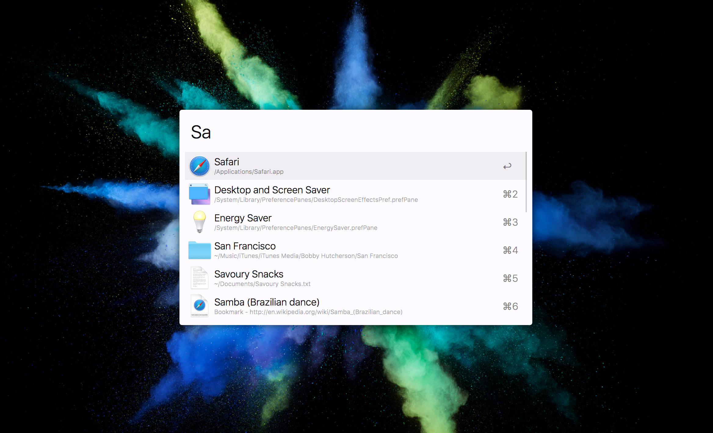

# Pure theme for Alfred

Clean and minimalistic theme for [Alfred](https://www.alfredapp.com/)

## Preview



## Install

### Setup via GitHub

1. Download:

```
$ git clone https://github.com/skrzyszewski/alfred-theme-pure.git
```

2. Double-click on a theme to install.

### Setup via Packal

1. Import theme from Packal: [Pure theme for Alfred](http://www.packal.org/theme/pure)